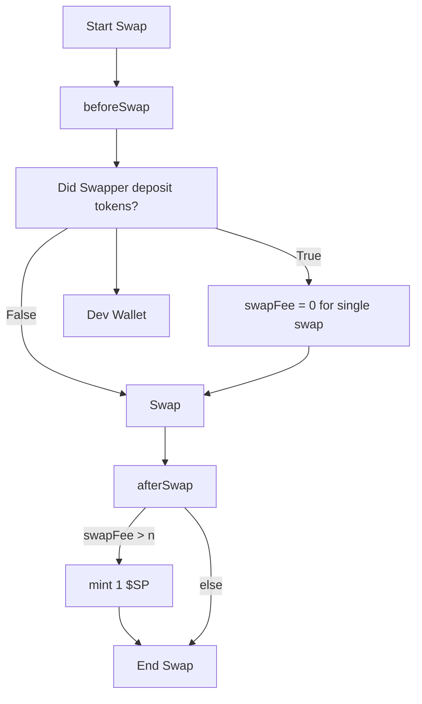

# SwoopPon: Liquidity Rewards System

SwoopPon is a smart contract system built on Uniswap V4 that provides a liquidity rewards mechanism. It allows liquidity providers to accumulate SwoopPon tokens through swaps, which can later be redeemed for fee discounts.

## Overview

The SwoopPon system consists of two main components:

1. **SwoopPon Contract**: A Uniswap V4 hook that overrides fees and mints reward tokens to users.
2. **TokenVault Contract**: Manages user token balances and handles deposits/withdrawals.

## How It Works

- **Earning SwoopPon Tokens**: Users earn 1 SwoopPon token for each swap they perform.
- **Fee Discounts**: Users who have accumulated more than 5 ETH worth of tokens in the vault get their swap fees reduced to zero.
- **Token Management**: Users can deposit tokens into the vault to build up their balance.

## Key Features

- **Dynamic Fee Adjustment**: The system can dynamically adjust fees based on user balances.
- **Reward Mechanism**: Rewards users with tokens for participating in swaps.
- **Price Oracle Integration**: Uses Chainlink price feeds for ETH and BTC.

## Contract Structure

- `SwoopPon.sol`: Main contract that implements the Uniswap V4 hook interface and handles token rewards.
- `TokenVault.sol`: Manages user token balances and provides functionality for deposits and withdrawals.

## Getting Started

### Prerequisites

- Foundry
- Solidity ^0.8.24

So, ask yourself:

> What is this hook checking *before* the swap happens, and how does the result influence the fees or swap logic?

Now, how would you describe that in a README like the example? Here's a sketch of how you might start, once you've answered:

---

## 📄 Hook Name: **ZeroFeeConditionalHook**

A Uniswap V4 hook that sets the swap fee to zero for single-time swaps that meet a specific condition: whether the user has deposited tokens beforehand. If they haven’t, a developer wallet is funded instead.


## Hook Functionality

This hook intercepts the swap process and controls fee behavior based on user action, rewarding either the user or the dev depending on token deposit status.

### 🔁 Hook Points Used:

- `beforeSwap`:  
  Checks if the swapper has pre-deposited tokens into the system.

- `afterSwap`:  
  Evaluates the applied fee and mints 1 `$SP` token if the fee exceeds a threshold.

---

### 💡 Hook Logic Overview



---

### 🧩 Conditional Logic

This hook uses conditional logic to determine fee behavior:

- If the swapper **has deposited** tokens beforehand:
  - The swap is **free** (`swapFee = 0`)
- If not:
  - The fee is retained
  - A **Dev Wallet** is credited

After the swap, the hook evaluates:

> Was the **swap fee greater than `n`**?

If so, a reward token (`$SP`) is minted.

---

## ⚙️ Hook Flags

This hook uses the following Uniswap V4 lifecycle flags:

- ✅ `beforeSwap`
- ✅ `afterSwap`

No logic is implemented for:

- ❌ `beforeInitialize`
- ❌ `beforeModifyPosition`
- ❌ `afterModifyPosition`

---

### 🌱 Developer Token Reward Logic

If the swap fee exceeds a threshold, this hook mints a `$SP` token:

```solidity
if (swapFee > n) {
    mint(1 $SP);
}
```

### Deploy

```shell
$ forge script script/Deploy.s.sol:DeployScript --rpc-url <your_rpc_url> --private-key <your_private_key>
```

## Usage

1. Deploy the TokenVault contract, specifying the token address to be used.
2. Deploy the SwoopPon contract, passing in the pool manager and TokenVault addresses.
3. Users can deposit tokens to the vault using the `deposit` function.
4. When users perform swaps through pools with the SwoopPon hook, they automatically earn SwoopPon tokens.
5. Users with sufficient balances in the vault (>5 ETH worth) get their swap fees reduced to zero.

## Advanced Configuration

- The base fee can be modified using the `setFee` function.
- The contract owner can withdraw tokens from the vault using the `withdraw` function.
