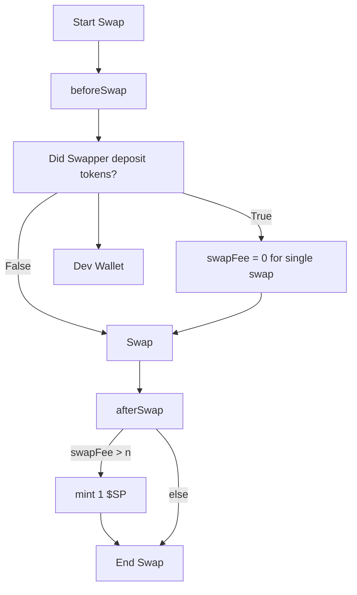

Here’s a Socratic-style way to help *you* think through how to write the README for your hook based on the diagram XML you provided. Let’s begin with a key question:

### What does this hook do in the context of a swap?

To help you reflect, let’s walk step-by-step through the logic of the diagram.

---

## 🧠 What behavior happens before the swap?

Looking at the XML, there’s a node labeled **beforeSwap**, which transitions into a decision node:

- ❓ _“Did Swapper deposit tokens?”_
  - If **True**: the flow goes to `swapFee = 0 for single swap`
  - If **False**: the flow goes directly to **Swap**
  - Also: a third edge from the decision leads to **Dev Wallet**

So, ask yourself:

> What is this hook checking *before* the swap happens, and how does the result influence the fees or swap logic?

Now, how would you describe that in a README like the example? Here's a sketch of how you might start, once you've answered:

---

## 📄 Hook Name: **ZeroFeeConditionalHook**

A Uniswap V4 hook that sets the swap fee to zero for single-time swaps that meet a specific condition: whether the user has deposited tokens beforehand. If they haven’t, a developer wallet is funded instead.


## Hook Functionality

This hook intercepts the swap process and controls fee behavior based on user action, rewarding either the user or the dev depending on token deposit status.

### 🔁 Hook Points Used:

- `beforeSwap`:  
  Checks if the swapper has pre-deposited tokens into the system.

- `afterSwap`:  
  Evaluates the applied fee and mints 1 `$SP` token if the fee exceeds a threshold.

---

### 💡 Hook Logic Overview



---

### 🧩 Conditional Logic

This hook uses conditional logic to determine fee behavior:

- If the swapper **has deposited** tokens beforehand:
  - The swap is **free** (`swapFee = 0`)
- If not:
  - The fee is retained
  - A **Dev Wallet** is credited

After the swap, the hook evaluates:

> Was the **swap fee greater than `n`**?

If so, a reward token (`$SP`) is minted.

---

## ⚙️ Hook Flags

This hook uses the following Uniswap V4 lifecycle flags:

- ✅ `beforeSwap`
- ✅ `afterSwap`

No logic is implemented for:

- ❌ `beforeInitialize`
- ❌ `beforeModifyPosition`
- ❌ `afterModifyPosition`

---

### 🌱 Developer Token Reward Logic

If the swap fee exceeds a threshold, this hook mints a `$SP` token:

```solidity
if (swapFee > n) {
    mint(1 $SP);
}
```

Where does the minted token go?

> What’s your intention for `$SP`? Dev rewards? Community incentives?

---

Now, before I generate the full final README, let’s think:

> Do you want this hook to be open-source and generic?  
> Should the `$SP` token be configurable?  
> Is there on-chain logic for “deposit check,” or is it off-chain/preconditioned?

Answer these, and we can complete the README tailored to your intent.

Shall we proceed with the full generation? Or do you want to adjust the design first?
